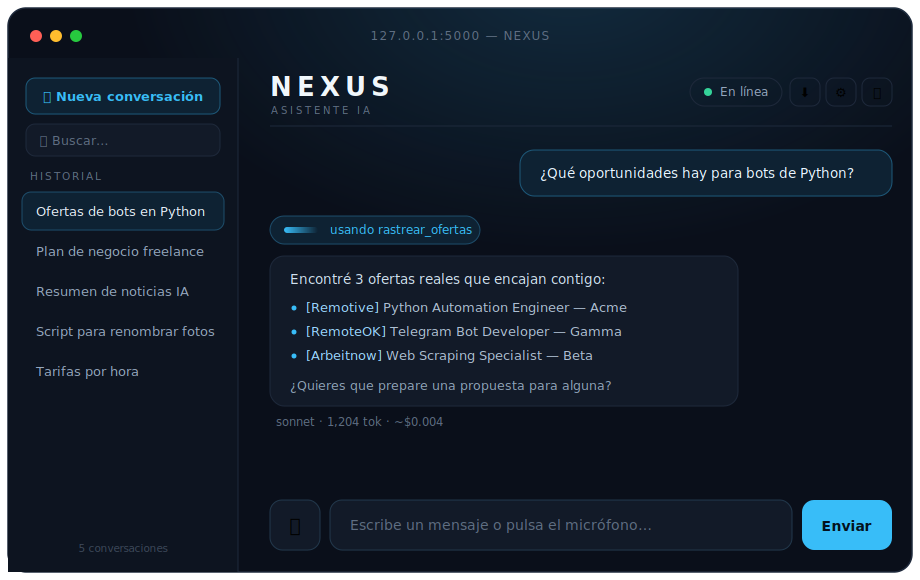
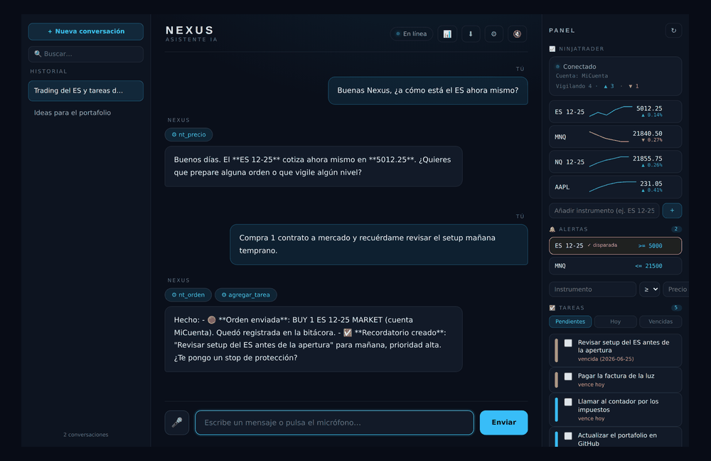

# N.E.X.U.S. — AI Personal Assistant

[](https://github.com/Barbarel001/nexus/actions/workflows/ci.yml)
[](LICENSE)
[](https://www.python.org/)





A personal AI assistant built in **Python** on top of the **Claude API (Anthropic)**.
It is a real **tool-using agent**: it holds a conversation, **remembers things across
sessions**, tracks real freelance job listings, searches the web, and can read/write
files and run commands on your machine (always with your confirmation).

It ships with **two interfaces**: a classic **terminal** client and a **web HUD**
(browser) with streaming responses, conversation history, and voice in/out.

> This is what's actually behind the "AI that does everything" hype: a language model
> wired to a set of tools through an agentic loop. A copilot, not a magic money machine.

---

## Why this project

It's a compact but complete example of an **agentic application**, demonstrating:

- **Agentic tool-use loop** — the model decides which tool to call, the app executes
  it, feeds the result back, and repeats until the task is done.
- **Function calling / tool definitions** against the Anthropic API.
- **Persistent memory** across sessions (long-term notes the agent writes itself).
- **Streaming** responses over **Server-Sent Events (SSE)** in the web UI.
- **Adaptive thinking**, safe-by-default permissions, and a clean separation between
  the terminal (full tools) and web (read-only tools) surfaces.

## Features

| Area | What it does |
|---|---|
| 🧠 **Persistent memory** | Remembers your name, preferences, goals and project facts between runs (`memoria.json`). |
| ✅ **Tasks & reminders** | Add / list / complete / delete tasks with **due dates** (`hoy`, `manana`, `AAAA-MM-DD`) and priority; overdue & due-today are flagged, and pending tasks greet you on startup (`tareas.json`). |
| 🛠️ **Tool use** | `recordar`, `rastrear_ofertas`, `web_search`, `run_command`, `read_file`, `write_file`, `list_directory`, task tools (`agregar_tarea`…), NinjaTrader tools (`nt_orden`…). |
| 💼 **Job tracker** | Pulls **real** remote/freelance listings from Remotive, RemoteOK, Arbeitnow and Jobicy by keyword. |
| 🌐 **Web HUD** | Flask + SSE streaming, sidebar with conversation history (open / rename / search / delete / export to Markdown), markdown rendering, responsive layout. |
| 📊 **Dashboard panel** | Right-side panel in the web UI: NinjaTrader status, a live **price watchlist** with **% change + sparklines**, **price alerts** (browser notifications), and **tasks** (filter + add + complete) — auto-refreshing. |
| 🚨 **Price alerts** | "Avísame si el ES toca 5000": create/list/delete alerts; the web panel polls and fires a **browser notification** when one triggers. |
| 🛡️ **Bracket orders (OCO)** | `nt_orden` can attach a **stop-loss** and **take-profit**; Nexus sends them as an OCO so one cancels the other. |
| 🎨 **Theme & PWA** | Light/dark theme + accent color picker; **installable as a PWA** (manifest + service worker) to use Nexus like a native app on your phone. |
| 🎙️ **Voice** | Text-to-speech (reads answers aloud) and speech-to-text (dictate by mic) via the Web Speech API. |
| 💸 **Cost meter** | Tokens used and estimated USD cost per turn (terminal and web), via a per-model price table. |
| 🎛️ **Model & settings** | Pick the model (Opus / Sonnet / Haiku) and set your name and default voice from an in-app settings panel. |
| ✅ **In-browser confirmation** | Optional web system actions (run commands / write files) gated behind an explicit approval modal. |
| 🆓 **Local model (free)** | Optional **Ollama** backend: runs a model on your own machine (Qwen2.5 / Llama 3.1) with tool-use + streaming, **$0 — no API tokens**. Pick it from ⚙ Settings. |
| 📈 **NinjaTrader bridge** | Trade from Nexus via NinjaTrader 8's file-based **AT Interface** (no extra deps): check status, read prices, read positions, **place / cancel / close orders** — every order gated behind explicit confirmation. |
| 🖥️ **Terminal client** | Full agent with the complete tool set, **streaming** responses and an iteration safety cap per turn. |
| 🔒 **Safe by default** | Confirms before running commands or writing files; the web UI disables system-level tools unless explicitly opted in. |

## Architecture

```
nexus.py          → Terminal agent: agentic loop + tool dispatch + adaptive thinking
nexus_web.py      → Flask server: SSE streaming, conversation persistence, web-safe tools
nexus_ollama.py   → Optional LOCAL backend (Ollama): runs a model on your PC, $0 / no API tokens
nexus_ninjatrader.py → NinjaTrader 8 bridge: builds/sends order files, reads prices (file AT Interface)
nexus_tareas.py   → Productivity: tasks & reminders (due dates, priority) persisted to tareas.json
nexus_alertas.py  → Price alerts on NinjaTrader instruments, persisted to alertas.json
web/index.html    → HUD front-end: streaming render, history sidebar, dashboard panel, voice, theme, PWA
web/manifest.webmanifest, web/sw.js → PWA manifest + service worker (installable app)
memoria.json      → Long-term memory (git-ignored; personal)
conversaciones.json → Web chat history (git-ignored; personal)
```

The web layer **reuses** the agent logic and tool implementations from `nexus.py`.
By default it exposes only the read-only tools (`recordar`, `rastrear_ofertas`, `read_file`,
`list_directory`); `run_command` and `write_file` are disabled in the browser unless you set
`NEXUS_WEB_ACCIONES=1`, in which case each call must be approved in a confirmation modal.

## Tech stack

- **Python 3.9+** (developed on 3.12)
- **`anthropic`** SDK — Claude API, tool use, streaming, adaptive thinking
- **Flask** — web server and SSE endpoint
- Vanilla JS front-end + **Web Speech API** for voice

---

## Getting started

**1. Install dependencies**
```bash
pip install -r requirements.txt
```

**2. Set your Anthropic API key** (get one at https://console.anthropic.com)
```bash
setx ANTHROPIC_API_KEY "sk-ant-..."   # Windows — reopen the terminal afterwards
# export ANTHROPIC_API_KEY="sk-ant-..."  # macOS / Linux
```

The key is read **only** from the environment variable — it is never stored in the code.

**3. Run it**
```bash
python nexus_web.py   # web HUD at http://127.0.0.1:5000 (recommended)
python nexus.py       # terminal client (full tool set)
```

## Example prompts

- "Track freelance jobs for Python and Telegram bots."
- "Remember that my rate is 20 USD/hour."
- "How much free RAM do I have right now?"
- "Search the web for the latest Godot 4 news and summarize it."

## Configuration

Everything is configurable via **environment variables** (no need to edit the code):

| Variable | Default | Purpose |
|---|---|---|
| `NEXUS_MODEL` | `claude-opus-4-8` | Claude model (`claude-sonnet-4-6` / `claude-haiku-4-5` are cheaper) |
| `NEXUS_NOMBRE` | `Senor` | How Nexus addresses you |
| `NEXUS_MAX_TOKENS` | `8000` | Max length per response |
| `NEXUS_MAX_NOTAS` | `200` | Cap on long-term memory notes (FIFO) |
| `NEXUS_CONFIRMAR` | `1` | `0` runs terminal commands without asking (⚠️ use with care) |
| `NEXUS_WEB_ACCIONES` | `0` | `1` enables system actions in the web UI (always behind the confirmation modal) |
| `NEXUS_PORT` | `5000` | Web server port |
| `NEXUS_HOST` | `127.0.0.1` | Bind address. `0.0.0.0` exposes Nexus on your local network so you can open it from your phone (same Wi-Fi) at `http://<your-PC-IP>:5000` |
| `NEXUS_PASSWORD` | *(none)* | If set, Nexus requires a login (password) before access. Use it whenever you expose Nexus beyond your PC (LAN or a public tunnel) |
| `NEXUS_SECRET` | *(random)* | Secret key for signing the login session cookie. Set a fixed value to stay logged in across restarts |
| `NEXUS_BACKEND` | `claude` | `claude` (API) or `ollama` (local model, $0) |
| `NEXUS_OLLAMA_MODEL` | `qwen2.5:7b` | Ollama model used in local mode |
| `OLLAMA_HOST` | `http://localhost:11434` | Ollama server URL |
| `NEXUS_NT_FOLDER` | *(auto)* | NinjaTrader 8 `incoming` folder (auto-detected under `Documents/NinjaTrader 8/incoming`) |
| `NEXUS_NT_ACCOUNT` | `Sim101` | Default NinjaTrader account. **Defaults to the simulation account**; set your real account name to trade live |
| `NEXUS_NT_ESPERA` | `2.5` | Seconds to wait for NinjaTrader to write a price file |
| `NEXUS_NT_SIMULAR` | `0` | `1` = **simulation mode**: simulated moving prices, orders logged locally but sent nowhere. Try the whole flow without NinjaTrader |
| `NEXUS_TAREAS_PATH` | `tareas.json` | Where tasks & reminders are stored (git-ignored) |
| `NEXUS_ALERTAS_PATH` | `alertas.json` | Where price alerts are stored (git-ignored) |
| `NEXUS_NT_LOG` | `nexus_trades.log` | Trade audit log file (git-ignored) |

In the web UI you can also pick the model and set your name from the **⚙ settings panel**.

## Local model (zero API cost)

Don't want to spend API tokens? Nexus can run on a **local model** via
[Ollama](https://ollama.com) — fully free, private and offline.

```bash
# 1. Install Ollama (https://ollama.com), then pull a tool-capable model:
ollama pull qwen2.5:7b        # or llama3.1:8b

# 2a. Use it for everything:
setx NEXUS_BACKEND ollama     # Windows (reopen the terminal afterwards)

# 2b. ...or just pick "Local — free $0" from the web ⚙ Settings (no restart).
```

In local mode **no API key is required** and every turn costs **$0**. Tool-use and
streaming work; quality is a notch below Claude. Set the model with `NEXUS_OLLAMA_MODEL`.

## Tasks & reminders

Nexus doubles as a lightweight personal organizer. Just talk to it:

- "Recuérdame pagar la luz mañana." → creates a task due tomorrow.
- "¿Qué tengo pendiente?" / "¿Qué vence hoy?" → lists tasks (overdue and due-today flagged).
- "Marca como hecha la del banco." → completes it.

Tasks carry a **due date** (`hoy`, `manana`, or `AAAA-MM-DD`) and a **priority**
(`alta` / `media` / `baja`), are sorted by soonest deadline, and live in
`tareas.json` (git-ignored, personal). On terminal startup Nexus greets you with a
one-line summary of what's pending, overdue and due today. Tools: `agregar_tarea`,
`listar_tareas`, `completar_tarea`, `eliminar_tarea` — all read/write only Nexus's
own file, so they're available in the web UI too, no confirmation needed.

## NinjaTrader (trading from Nexus)

Nexus can drive **NinjaTrader 8** through its official **file-based AT Interface** —
no extra libraries, no broker API keys. Nexus drops *Order Instruction Files* in
NinjaTrader's `incoming` folder and reads the price files NinjaTrader writes back.

**Try it first without NinjaTrader (simulation mode):**

```bash
# Windows
set NEXUS_NT_SIMULAR=1 && python nexus_web.py
# macOS / Linux
NEXUS_NT_SIMULAR=1 python nexus_web.py
```
Prices move on their own, alerts trigger, and orders are logged locally (sent
nowhere). Perfect for a safe first test of the whole flow. Run a quick setup check
any time with:
```bash
python nexus_ninjatrader.py     # prints a diagnostic report
```

**Setup for real trading (one time):**

1. In NinjaTrader 8: `Tools → Options → Automated trading interface` → enable **AT Interface**.
2. (Optional) point Nexus at your real account:
   ```bash
   setx NEXUS_NT_ACCOUNT "MyRealAccountName"   # default is Sim101 (simulation)
   ```

**Tools the agent can use:**

| Tool | What it does | Safety |
|---|---|---|
| `nt_estado` | Check the bridge / connection and default account | read-only |
| `nt_precio` | Last / bid / ask price for an instrument | read-only |
| `nt_posicion` | Current open position for an instrument | read-only |
| `nt_historial` | Recent orders Nexus has sent (audit log) | read-only |
| `nt_orden` | **Place** an order (market / limit / stop) | ⚠️ confirmation required |
| `nt_cancelar` | Cancel one order (or all) | ⚠️ confirmation required |
| `nt_cerrar` | Close a position (or flatten everything) | ⚠️ confirmation required |

> **Real money.** Every order goes through the same confirmation gate as `run_command`:
> in the terminal you approve it inline; in the web UI it's blocked unless
> `NEXUS_WEB_ACCIONES=1` and then each order needs explicit approval in the modal.
> The default account is `Sim101` (simulation) until you change it — **test in sim first.**

**Audit trail.** Every order / cancel / close Nexus sends is appended to
`nexus_trades.log` (git-ignored) with a timestamp and outcome — a permanent record
of what was traded and when. Ask *"muéstrame mis últimas operaciones"* (`nt_historial`)
to review it. Writing the log can never interrupt or fail an order.

Example prompts:
- "¿A cuánto está el ES ahora mismo en NinjaTrader?"
- "Compra 1 MNQ a mercado." *(asks you to confirm before sending)*
- "Compra 1 ES con stop-loss en 4990 y take-profit en 5030." *(sends an OCO bracket)*
- "Avísame si el ES toca 5000." *(creates a price alert)*
- "Cierra mi posición en NQ" / "Aplana todo."

**Bracket / OCO.** Pass `stop_loss` and/or `take_profit` to `nt_orden` and Nexus
sends the protective orders alongside the entry, sharing an OCO id so that when one
fills the other is cancelled.

## Tests

The suite covers the pure logic without hitting the network or the Claude API
(job-listing parsing is tested with a mocked HTTP layer; memory and conversation
persistence with temp files):

```bash
pip install -r requirements-dev.txt
pytest
```

CI runs the full suite on every push via GitHub Actions.

## Security

Nexus can run commands and write files on your machine, so it **asks for confirmation**
before doing so. Read the command before approving. In the web UI those tools are
**disabled by default**; enable them with `NEXUS_WEB_ACCIONES=1`, and every system action
still requires explicit approval in an in-browser confirmation modal. The server binds to
`127.0.0.1` only. Personal data (`memoria.json`, `conversaciones.json`) is git-ignored and
never published.

## Roadmap

- [x] Test suite (pytest) + CI (GitHub Actions)
- [x] Context-window trimming for long sessions
- [x] In-browser confirmation modal for system actions (opt-in)
- [x] Token & cost meter per turn
- [x] Model picker, settings panel, conversation rename / search / export
- [x] UI mockup in the README
- [x] More job sources — Remotive, RemoteOK, Arbeitnow, Jobicy (next: Workana, Upwork, r/forhire)
- [x] Streaming responses in the terminal client
- [x] Tool-use chips shown when reopening a conversation
- [x] Local model backend (Ollama) — $0, no API tokens
- [x] NinjaTrader 8 bridge (file AT Interface): prices, positions, place/cancel/close orders
- [x] Tasks & reminders (due dates, priority) with startup summary
- [x] Web dashboard panel: NinjaTrader status, price watchlist, pending tasks
- [x] Trade audit log + `nt_historial`, and crash-safe tool dispatch
- [x] Persist the *full* agentic tool-use blocks across reloads
- [x] Animated demo GIF
- [x] Bracket orders (OCO: stop-loss + take-profit)
- [x] Price alerts with browser notifications
- [x] Watchlist with % change + sparklines
- [x] Light/dark theme + accent color
- [x] Installable PWA (manifest + service worker)

---

*Built with the Claude API. UI text is in Spanish; the assistant converses in Spanish.*
